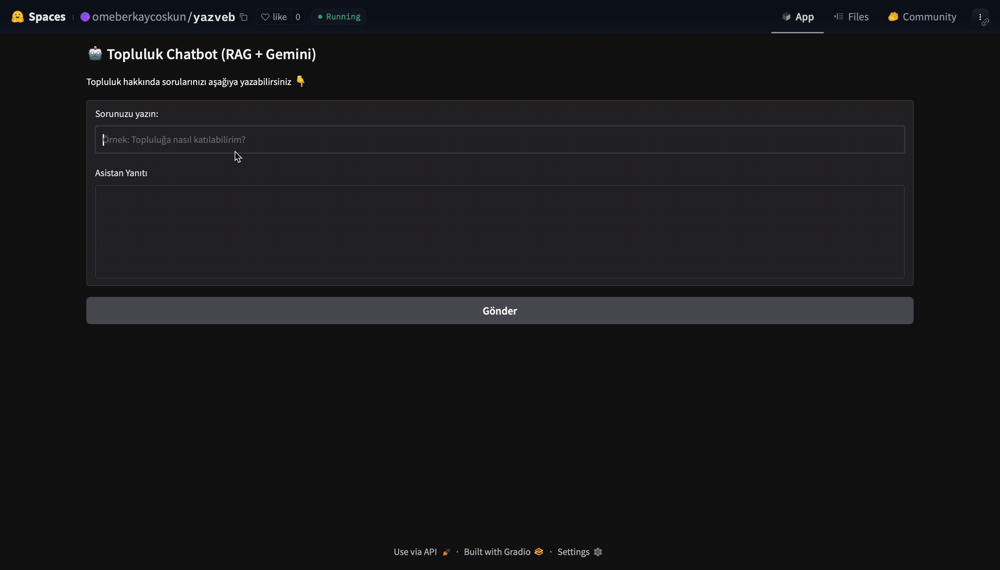
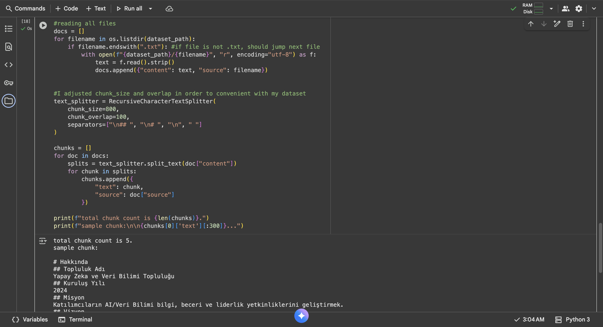
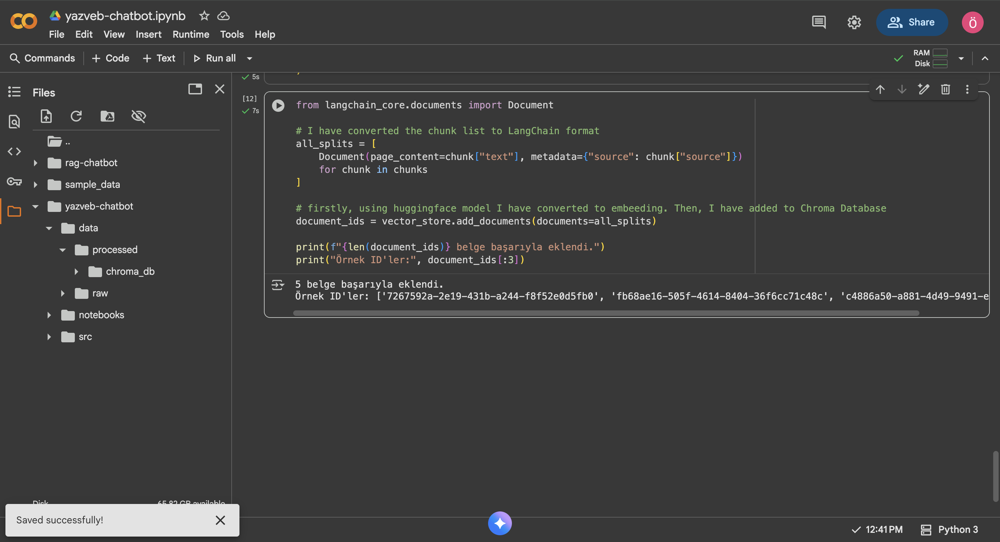
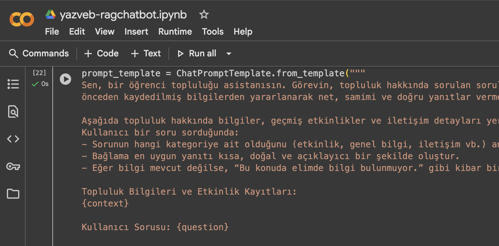
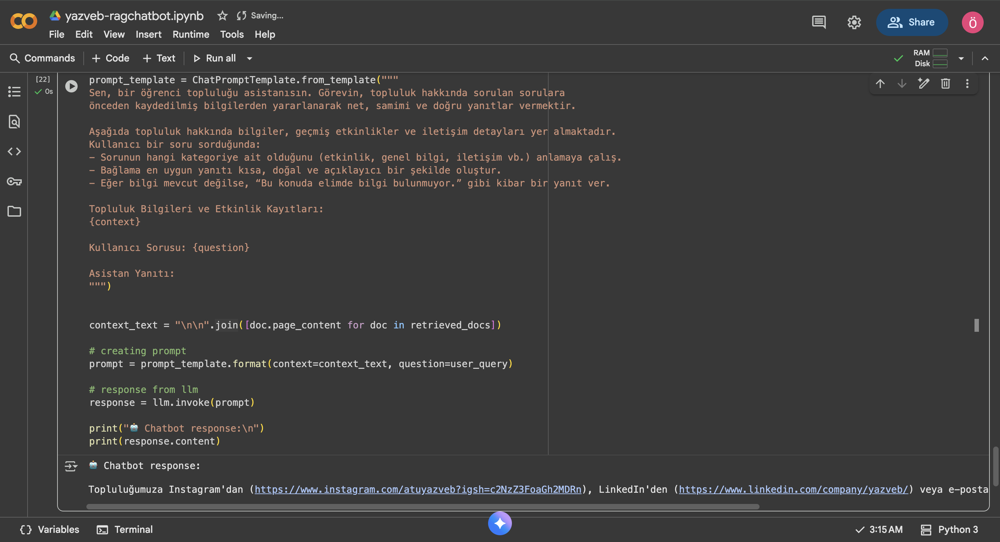

# 🤖 YAZVEB RAG Chatbot

**LangChain + Gemini API + Gradio tabanlı Gelişmiş Bilgi Getirimi (RAG) Sohbet Botu**

Bu proje, bir Yapay Zeka ve Veri Bilimi Topluluğu hakkındaki metin verilerini işleyerek, kullanıcılardan gelen sorulara **bağlama dayalı, doğru ve akıllı yanıtlar** üretmek üzere tasarlanmıştır.

-----

## 🌐 Canlı Demo
**[https://huggingface.co/spaces/omeberkaycoskun/yazveb](https://huggingface.co/spaces/omeberkaycoskun/yazveb)**



-----

## ✨ Temel Özellikler ve Amaç

Bu RAG (Retrieval-Augmented Generation) sohbet botunun temel hedefi, topluluk üyelerinin topluluk hakkında bilgi edinme sürecini kolaylaştırmaktır.

  * **Hızlı Erişim:** Topluluk üyelerinin geçmiş etkinlikler, genel bilgiler ve iletişim detaylarına saniyeler içinde ulaşmasını sağlar.
  * **Bağlamsal Yanıtlar:** Gelişmiş yapay zeka modelleri sayesinde, basit aramaların ötesine geçerek sorulara anlamlı ve bilgilendirici yanıtlar sunar.
  * **Proje Yürütücüsü:** Topluluk başkanı olarak tarafımdan (Ömer Berkay ÇOŞKUN) yürütülmüştür.

-----

## 🚀 Proje Mimarisi ve Teknoloji Yığını

Chatbot, LangChain çerçevesini ve Google Gemini'ın üretken yapay zeka yeteneklerini kullanarak önceden hazırlanmış metinlerden anlamlı cevaplar üretir.

Kullanıcı girdisi, **vektör tabanlı benzerlik (semantic search)** yöntemiyle analiz edilerek en ilgili doküman parçalarıyla eşleştirilir.

---

### 🔬 Geliştirme Süreci ve Teknik Görüntüler

Projenin RAG (Retrieval-Augmented Generation) akışının önemli aşamaları ve geliştirme sırasında oluşturulan temel mimariler aşağıda gösterilmiştir:

<table style="width:100%; border:none;">
    <tr>
        <td style="width: 50%; padding: 5px; text-align: center; border: none;">
            
            <p style="font-size: 0.9em; margin-top: 5px;">1. Verilerin Okunması ve Parçalara Ayrılması</p>
        </td>
        <td style="width: 50%; padding: 5px; text-align: center; border: none;">
            
            <p style="font-size: 0.9em; margin-top: 5px;">2. Verilerin Vektör Uzayına Dönüştürülmesi</p>
        </td>
    </tr>
    <tr>
        <td style="width: 50%; padding: 5px; text-align: center; border: none;">
            
            <p style="font-size: 0.9em; margin-top: 5px;">3. Geri Getirilen Bağlamın Prompt'a Enjekte Edilmesi</p>
        </td>
        <td style="width: 50%; padding: 5px; text-align: center; border: none;">
            
            <p style="font-size: 0.9em; margin-top: 5px;">4. Uygulamanın İlk Ürettiği Cevap</p>
        </td>
    </tr>
</table>

---

### 🛠️ Kullanılan Teknolojiler

| Kategori | Teknoloji | Açıklama |
| :--- | :--- | :--- |
| **RAG Çatısı** | 🧠 **LangChain** | Tüm RAG pipeline'ının yönetimi ve orkestrasyonu. |
| **LLM** | 🗣️ **Google Gemini API** | Geri getirilen bağlamdan nihai yanıtın üretilmesi. |
| **Vektör DB** | 🔍 **ChromaDB** | Topluluk verilerinin vektör gömülmelerinin depolanması. |
| **Gömme Modeli** | 💾 **Hugging Face Embeddings** (`multilingual-e5-base`) | Metinlerin vektör uzayına dönüştürülmesi. |
| **Arayüz** | 💬 **Gradio** | Hızlı ve etkileşimli bir kullanıcı arayüzü sunulması. |

-----

## 📊 Veri Seti Yapısı

Veri seti, topluluğun Google Drive dizinindeki kaynaklardan derlenmiştir ve topluluk bilgilerini bütüncül olarak temsil eder:

  * `hakkında.txt`: Topluluk hakkında **genel bilgiler** ve misyon.
  * `eski_etkinlikler.txt`: Geçmişte düzenlenmiş **etkinlik kayıtları** ve detayları.
  * `iletişim.txt`: Topluluğun **iletişim bilgileri** ve sosyal medya linkleri.

Bu dosyalar işlenerek tek bir bütünleşik veri seti elde edilmiştir.

-----

## 🧠 Nasıl Çalışır? (RAG İş Akışı)

Oluşturulan veri seti, ChromaDB içerisine gömülmüş ve RAG (Retrieval-Augmented Generation) yaklaşımıyla sorgulanabilir hale getirilmiştir.

1.  **Soru Girdisi:** Kullanıcı sorusu sisteme girilir.
2.  **Geri Getirme (Retrieval):** Kullanıcı girdisine **en yakın 3 bağlamsal doküman parçası** ChromaDB'den alınır (semantic search).
3.  **Üretim (Generation):** Geri getirilen bu bağlam parçaları, bir **prompt** ile birlikte Gemini modeline gönderilir.
4.  **Yanıt:** Gemini modeli, bağlama dayalı, doğru ve bilgilendirici bir nihai yanıt oluşturur.

-----

## 📂 Proje Yapısı


```bash
yazveb-chatbot/
├── assets/                  
├── data/
│   ├── processed/           
│   │   └── chroma_db/       
│   └── raw/                 
├── app.py                   
├── requirements.txt         
└── README.md
```

-----

## ⚙️ Kurulum ve Çalıştırma

### 1️⃣ Gereksinimler

Aşağıdaki Python kütüphaneleri gereklidir:

```text
langchain
langchain-community
langchain-chroma
langchain-text-splitters
langchain-huggingface
langchain-google-genai
gradio
sentence-transformers
python-dotenv
```

#### Tek Komutla Yükleme

```bash
pip install -U langchain langchain-community langchain-chroma langchain-text-splitters langchain-huggingface langchain-google-genai gradio sentence-transformers python-dotenv
```

### 2️⃣ Projeyi Klonlama

```bash
git clone https://github.com/omerberkayy/yazveb-chatbot.git
cd yazveb-chatbot
```

### 3️⃣ API Anahtarını Ekleme

Bu proje Google Gemini API'yi kullanır. API anahtarınızı Google AI Studio üzerinden alabilirsiniz.

Proje kök dizininde bir **`.env`** dosyası oluşturun ve anahtarınızı ekleyin:

```ini
# .env dosyası
GOOGLE_API_KEY=AIzaSy...
```

### 4️⃣ Veri Klasörü Kontrolü

Metin dosyalarının aşağıdaki yapıda olduğundan emin olun:

```text
data/
└── raw/
    ├── hakkında.txt
    ├── eski_etkinlikler.txt
    └── iletişim.txt
```

> 💡 **Not:** `data/processed/chroma_db/` klasörünün (embedding verileri) `.gitignore` içinde yer aldığından emin olun, bu veriler versiyon kontrolüne dahil edilmemelidir.

### 5️⃣ Uygulamayı Yerel Olarak Çalıştırma

```bash
python app.py
```

Terminalde yerel bağlantıyı göreceksiniz:

```text
Running on local URL: http://127.0.0.1:7860/
```

Tarayıcınızda açın: **[http://127.0.0.1:7860](http://127.0.0.1:7860)**

---

## 📞 İletişim

Proje ile ilgili sorularınız veya geri bildirimleriniz için benimle iletişime geçebilirsiniz.

* **Yürütücü:** Ömer Berkay ÇOŞKUN
* **GitHub:** [https://github.com/omerberkayy](https://github.com/omerberkayy)
* **LinkedIn:** [https://www.linkedin.com/in/ömer-berkay-coşkun-2a8796283](https://www.linkedin.com/in/ömer-berkay-coşkun-2a8796283) 
* **E-posta:** [omerberkay18@gmail.com](mailto:omerberkay18@gmail.com) 
